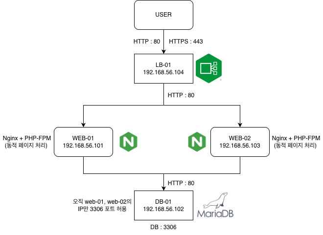

# 리눅스 Ubuntu 기반 3-Tier 다중 서버 인프라 구축

Ubuntu 기반 가상 머신 4대로 로드밸런서·웹서버·DB서버를 분리 구성하고,
Prometheus, Grafana 모니터링 대시보드로 리소스를 실시간 감시할 수 있는 프로젝트입니다.

서비스 가용성 확보를 위해 L7 로드밸런싱이 적용된 Ubuntu 기반 3-Tier 아키텍처를 구축하고, 
리소스 실시간 모니터링을 위해 Prometheus, Grafana 모니터링 대시보드 환경을 구성했습니다. 
이후 인프라의 재사용성과 배포 속도 향상을 위해 전체 구축 과정을 Ansible로 자동화한 프로젝트입니다. 

> 진행 기간: 2026.04 ~ 2026.05


## 아키텍처



- 0호기(LB) → 1호기/3호기(Web) → 2호기(DB)
- 1호기 장애 시 3호기로 자동 전환


## 기술 스택


## 디렉토리 구조
```
multi-server-infra/
│
├── site.yml                    # 마스터 플레이북 - 전체 인프라 자동 구축
├── hosts.yml                   # 인벤토리 - 서버 목록 및 vault 변수 연결
├── hosts.ini                   # 인벤토리 참고용 (비밀번호 없는 버전)
├── .gitignore                  # vault.yml 깃허브 업로드 제외
├── README.md                   # 프로젝트 설명
│
├── mariadb_setup.yml           # DB 서버 구축 자동화
├── web_setup.yml               # Web 서버 구축 및 PHP 배포 자동화
├── lb_setup.yml                # 로드밸런서 구축 자동화
├── node_exporter_setup.yml     # 전체 서버 모니터링 에이전트 설치 자동화
├── prometheus_setup.yml        # Prometheus + Grafana 설치 자동화
│
├── group_vars/
│   └── all/
│       └── vault.yml           # ansible vault로 암호화된 서버 비밀번호 (gitignore 처리)
│
└── templates/
    ├── index.php.j2            # PHP 웹 페이지 템플릿 (DB 연결 및 접속 로그)
    ├── lb_default.conf.j2      # Nginx 로드밸런서 설정 템플릿
    └── nginx_web.conf.j2       # Nginx + PHP-FPM 연동 설정 템플릿
```


## 주요 기능 
- 다중 서버 구축, 자동화, 로드밸런싱, 모니터링

## 핵심 수행 내용 
- Virtual box 네트워크 (NAT + Host-only) 를 활용한 독립적인 사설 인프라 환경망 분리
- Nginx Upstream 모듈을 활용한 L7 로드밸런서 구축 및 Web 서버 트래픽 분산 
- MariaDB 보안 초기화 및 화이트리스트 기반의 방화벽 규칙을 적용한 데이터 베이스 보호 
- 가용성 확보 및 OOM 방지를 위한 Swap 메모리 구성 및 SSH 키 기반 인증을 통한 인프라 보안 강화 
- 모든 구축 과정을 모듈화한 마스터 플레이북 (site.yml) 을 작성하여 초기 서버 세팅부터 모니터링 환경 구축까지의 과정을 자동화


## 트러블슈팅

###  DB 백업 자동화 스크립트 실행 거부 (MySQL Host 권한 분리)

| 구분 | 내용 |
|---|---|
| 문제 상황 | Crontab에 등록할 백업 쉘 스크립트(db_backup.sh)를 web_user 계정으로 실행 테스트했으나, Access denied for user 'web_user'@'localhost' 에러가 발생하며 백업에 실패 |
| 원인 파악 | 웹 서버 연동 시 외부 접속을 위해 'web_user'@'192.168.56.%' 권한만 부여했었으나, MariaDB는 접속하는 IP(Host)를 엄격히 분리하기 때문에 DB 서버 내부(로컬)에서 스크립트를 실행할 때 필요한 localhost 출입 권한이 없어 차단된 것 |
| 해결 방법 | MariaDB에 root 계정으로 접속하여 CREATE USER 'web_user'@'localhost'로 로컬 전용 계정을 추가 생성하고, 타겟 DB에 권한을 부여(GRANT ALL)하여 스크립트가 정상 동작하도록 해결 |
| 결과 | db_backup.sh 파일 스크립트가 정상적으로 실행되어 파일이 생성되는 것을 확인함  |


###  Crontab 스케줄링 미작동 (유저 권한 및 스케줄러 환경 격리)

| 구분 | 내용 |
|---|---|
| 문제 상황 | 위의 백업 파일 실행까진 성공했으나 매일 새벽 3시에 백업되도록 설정한 crontab이 실행되지 않았고, 터미널에서 crontab -l을 입력해도 등록된 스케줄이 보이지 않았음 |
| 원인 파악 | 스케줄을 등록할 때 무의식적으로 sudo crontab -e를 입력하여, 현재 로그인한 일반 유저의 크론탭이 아닌 root 유저의 독립된 크론탭에 백업 작업이 등록되었기 때문. 또한 백업 디렉터리의 소유권을 일반 유저로 변경해 둔 상태라 권한 충돌도 있었음 |
| 해결 방법 | root 크론탭의 내용을 삭제하고, 일반 유저 권한으로 crontab -e를 다시 실행해 스케줄을 올바르게 등록함. 이후 syslog를 통해 CRON 실행 로그를 확인하여 동작을 완벽히 검증 |
| 결과 | Crontab 이 정상적으로 실행되어 스케줄링이 적용된 것을 확인함 |


### Ansible 자동화 배포 후 403 Forbidden 에러 (Nginx 라우팅 설정)

| 구분 | 내용 |
|---|---|
| 문제 상황 | Ansible Playbook으로 Web 서버를 구축할 때, 불필요한 기본 환영 페이지(index.nginx-debian.html)를 삭제하는 Task를 추가함. 그러나 배포 완료 후 웹에 접속하자 403 Forbidden 에러가 발생 |
| 원인 파악 | error.log를 확인해 보니 Nginx의 디렉터리 인덱싱 차단 문제. 기존에는 기본 html 파일이 있어 접속이 되었으나, 삭제 후 Nginx 설정 파일의 try_files $uri $uri/ =404; 구문이 대체할 index.php를 찾지 못하고 라우팅을 차단한 구조적 에러였음. |
| 해결 방법 | Jinja2 템플릿의 Nginx 설정 파일(nginx_web.conf.j2)에서 location 블록을 try_files $uri $uri/ /index.php?$args;로 수정하여 정적 파일이 없을 때 PHP로 정상 라우팅되도록 수정 후 Playbook을 다시 배포함 |
| 결과 |  |


### CPU 모니터링 스크립트 오류 및 측정 방식 개선

| 구분 | 내용 |
|---|---|
| 문제 상황 | CPU 사용량이 100%로 잘못 표시됨 |
| 원인 파악 | awk 계산 방식이 서버 출력 포맷과 불일치 |
| 해결 방법 | mpstat으로 측정 방식 변경 |
| 결과 | 실제 부하가 정상적으로 반영됨 |


## 실행 방법
git clone부터 site.yml 실행까지 순서

$ ansible-playbook -i hosts.yml site.yml --ask-vault-pass


## 실행 결과 스크린샷 
<p align="center">
    
    \n
    로드밸런싱 성공 화면
</p>


<p align="center">

    Prometheus&Grafana 모니터링 화면
</p>


## 회고 및 개선할 점
이걸 aws 에 올려서 서버 만들고 바로 자동화 툴로 서버 세팅하는 것도 하려고 계획함. 

실제 가동되는 서비스를 올려보지 못한 것이 아쉬움 


